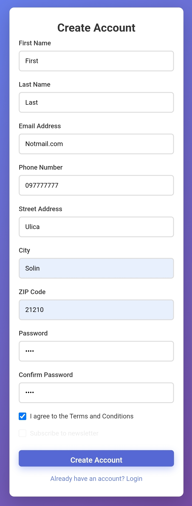
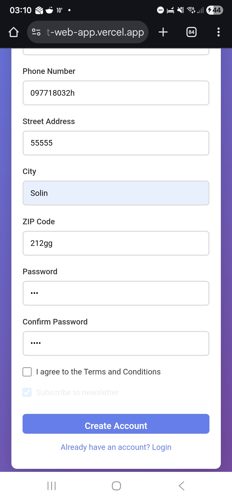

# Bug Reports - User Registration

## Bug Severity Definitions

- **Critical**: Application crash, data loss, security vulnerability, complete feature failure, **missing critical security/validation features**
- **High**: Major functionality broken or **missing**, no workaround available
- **Medium**: Functionality impaired but workaround exists, minor validation missing
- **Low**: Cosmetic issues, typos, minor UX improvements

## Bug Category Types

- **Missing Feature**: Expected functionality not implemented at all
- **Broken Feature**: Implemented functionality not working correctly
- **Validation Gap**: Missing or insufficient input validation
- **UX Issue**: Poor user experience, confusing flow
- **Security Issue**: Potential security vulnerability
- **Visual/UI Bug**: Display or styling problems

---

## Critical Issues - Missing Validation

### BUG-001: Email Validation Completely Missing
- **Severity**: Critical
- **Category**: Validation Gap / Security Issue
- **Priority**: High
- **Status**: New
- **Environment**: 
  - Browser: Chrome 133
  - OS: Windows 10
  - URL: https://qa-test-web-app.vercel.app/

- **Description**: 
  The registration form accepts any string in the email field without validation, allowing invalid email addresses to be submitted.
  
- **Steps to Reproduce**:
  1. Navigate to registration page
  2. Fill in all fields with valid data except email
  3. Enter clearly invalid email formats:
     - "notanemail"
     - "missing@domain"
     - "@nodomain.com"
     - "just text with spaces"
  4. Check "I agree to Terms and Conditions"
  5. Click "Create Account"
  
- **Expected Behavior (Industry Standard)**: 
  - Client-side validation should check email format BEFORE form submission
  - Error message should appear: "Please enter a valid email address"
  - Invalid field should be highlighted (red border, error icon)
  - Form should NOT submit
  - User should remain on registration page with data preserved
  - At minimum, should validate:
    * Presence of '@' symbol
    * Presence of domain (text after @)
    * Presence of TLD (.com, .org, etc.)
    * No spaces in email
  
- **Actual Behavior**:
  - Email field uses `type="text"` instead of `type="email"`, bypassing browser-level validation
  - Client-side validation uses a weak regex (`/\S+@\S/`) that accepts invalid formats like `test@x`, `@b`, `a@.`
  - Only emails completely missing `@` are rejected (e.g., "notanemail")
  - Formats like `user@` and `@domain.com` incorrectly pass validation
  - Form submits successfully with malformed emails
  - User redirected to login page with success message
  
- **Impact**: 
  - Users can register with invalid emails
  - Cannot receive password recovery emails
  - Cannot receive account notifications
  - Database filled with garbage data
  - Poor user experience - silent failures with no feedback
  - Violates basic web form standards
  
- **Recommendation**:
  Implement HTML5 email validation at minimum (`type="email"`), plus JavaScript validation for comprehensive checks.
  
- **Screenshots**: 
- **Related Test Cases**: TC-008, TC-009, TC-010, TC-011

---

### BUG-002: Error Messages Hidden on Mobile Devices
- **Severity**: Critical
- **Category**: Visual/UI Bug / UX Issue
- **Priority**: High
- **Status**: New
- **Environment**: 
  - Browser: Chrome 144
  - OS: Android 16, One UI 8.0
  - URL: https://qa-test-web-app.vercel.app/
  
- **Description**:
  On mobile viewports (below 767px), all validation error messages are hidden via CSS rule `.error-message { display: none !important; visibility: hidden; }`. Users receive no feedback when submitting invalid data.

- **Steps to Reproduce**:
  1. Open registration page on a mobile device or resize browser to <767px width
  2. Enter an invalid email (e.g., "notanemail")
  3. Fill remaining fields with valid data
  4. Click "Create Account"

- **Expected Behavior (Industry Standard)**:
  - Error messages should be visible on ALL screen sizes
  - Mobile users should receive the same validation feedback as desktop users
  - Error messages should be responsive and properly styled for mobile
  
- **Actual Behavior**:
  - On successful registration, user is redirected to login page with success message — this works correctly
  - On validation failure (e.g., email without `@`), error messages appear inline below the field
  - However, on mobile viewports (<767px), all error messages are hidden via CSS (`display: none !important`), making the form appear to silently reject input with no feedback
  - Form data IS preserved on validation failure (user stays on page)
  - The silent failure behavior is specific to mobile devices
  
- **Impact**:
  - Mobile users cannot see any validation errors
  - Appears as if form silently rejects input with no explanation
  - Users may abandon registration entirely
  - Violates accessibility standards (WCAG)
  - Significant portion of users access web apps from mobile devices

- **Recommendation**:
  Remove the `display: none !important` and `visibility: hidden` rules from the mobile media query for `.error-message`.

- **Screenshots**: 
  
  

- **Related Test Cases**: TC-042

---

### BUG-003: Password Strength Validation Missing
- **Severity**: High
- **Category**: Validation Gap / Security Issue
- **Priority**: High
- **Status**: New
- **Environment**: 
  - Browser: Chrome 133
  - OS: Windows 10
  - URL: https://qa-test-web-app.vercel.app/

- **Description**: 
  Registration form accepts weak passwords without any strength requirements or validation.
  
- **Steps to Reproduce**:
  1. Navigate to registration page
  2. Fill all fields with valid data
  3. Enter extremely weak password: "123"
  4. Confirm password: "123"
  5. Submit form
  
- **Expected Behavior (Industry Standard)**: 
  - Minimum password length enforced (typically 8-12 characters)
  - Requirements clearly stated (e.g., "Must contain uppercase, lowercase, number, special character")
  - Real-time feedback as user types (weak/medium/strong indicator)
  - Rejection of common weak passwords
  - Error message if requirements not met
  
- **Actual Behavior**:
  - Password validation only requires minimum 4 characters (`password.length >= 4`)
  - Passwords like "1234", "aaaa", "test" are accepted
  - "123" (3 chars) is correctly rejected with message "Password must be at least 4 characters"
  - No complexity requirements enforced (uppercase, lowercase, numbers, special characters)
  - No password strength indicator present
  - No real-time feedback while typing
  
- **Impact**: 
  - Weak passwords compromise account security
  - Increases risk of brute force attacks
  - Violates security best practices
  - May not comply with data protection regulations
  
- **Recommendation**:
  Implement password strength requirements with clear user feedback.
  
- **Related Test Cases**: TC-017, TC-018

---

### BUG-004: Phone Number Format Validation Missing
- **Severity**: Medium
- **Category**: Validation Gap
- **Priority**: Medium
- **Status**: New
- **Environment**: 
  - Browser: Chrome 133
  - OS: Windows 10
  - URL: https://qa-test-web-app.vercel.app/

- **Description**: 
  Phone number field accepts any text input without format validation.
  
- **Steps to Reproduce**:
  1. Navigate to registration page
  2. Enter non-numeric text in phone field: "abcdefgh"
  3. Submit form
  
- **Expected Behavior**: 
  - Only numeric input (and common separators like dash, parentheses) accepted
  - Format validation (e.g., minimum 10 digits)
  - Real-time formatting assistance (e.g., auto-insert dashes)
  - Error message for invalid format
  
- **Actual Behavior**:
  - Phone validation only checks `phone.length > 0` — any non-empty string passes
  - Accepts alphabetical strings like "abcdefgh", symbols like "!!!", and any arbitrary text
  - No format validation for phone number patterns
  - No input masking or auto-formatting

- **Impact**:
  - Invalid phone numbers stored in database
  - Cannot contact users by phone
  - Poor data quality

- **Recommendation**:
  Implement phone number validation accepting common formats (digits, dashes, parentheses, plus sign). Minimum 7-10 digit requirement.

- **Related Test Cases**: TC-013, TC-014

---

### BUG-005: Required Field Indicators Missing
- **Severity**: Medium
- **Category**: UX Issue
- **Priority**: Medium
- **Status**: New
- **Environment**: 
  - Browser: Chrome 133
  - OS: Windows 10
  - URL: https://qa-test-web-app.vercel.app/

- **Description**: 
  Registration form does not clearly indicate which fields are required vs optional.
  
- **Steps to Reproduce**:
  1. Navigate to registration page
  2. Observe form fields
  3. Look for asterisks (*) or "required" labels
  
- **Expected Behavior**: 
  - Required fields marked with asterisk (*) or "required" label
  - Legend explaining marking system
  - Visual distinction between required and optional fields
  
- **Actual Behavior**:
  - No asterisks, "required" labels, or any other visual indicators
  - HTML `required` attribute is present on input fields but not visually communicated to users
  - Users must attempt submission to discover which fields are required
  - Newsletter and Terms checkboxes have no visual distinction despite different requirement levels
  
- **Impact**: 
  - Users don't know what's required
  - Increases form abandonment
  - Poor accessibility
  
- **Recommendation**:
  Add asterisks or "required" labels to mandatory fields.
  
- **Related Test Cases**: TC-030

---

### BUG-006: Password Confirmation Validation Always Passes
- **Severity**: Critical
- **Category**: Broken Feature / Security Issue
- **Priority**: High
- **Status**: New
- **Environment**:
  - Browser: Chrome 133
  - OS: Windows 10
  - URL: https://qa-test-web-app.vercel.app/register.html

- **Description**:
  The `validatePasswordMatch()` function always returns `true` regardless of whether the password and confirm password fields match. Users can register with mismatched passwords.

- **Steps to Reproduce**:
  1. Navigate to registration page
  2. Fill all fields with valid data
  3. Enter password: "SecurePass123!"
  4. Enter confirm password: "CompletelyDifferent456!"
  5. Click "Create Account"

- **Expected Behavior (Industry Standard)**:
  - Form should NOT submit when passwords don't match
  - Error message: "Passwords do not match"
  - Confirm password field should be highlighted

- **Actual Behavior**:
  - Registration succeeds despite passwords not matching
  - No error message displayed
  - The password stored is the value from the "Password" field (not "Confirm Password")
  - User may not realize they registered with a different password than intended

- **Impact**:
  - Users may be unable to log in after registration (if they remember the wrong password)
  - Defeats the entire purpose of the confirm password field
  - Poor user experience and potential lockout scenario

- **Recommendation**:
  Fix `validatePasswordMatch()` to actually compare `password === confirmPassword`.

- **Related Test Cases**: TC-016, TC-039, TC-041

---

### BUG-007: Terms and Conditions Checkbox Not Enforced
- **Severity**: Critical
- **Category**: Broken Feature
- **Priority**: High
- **Status**: New
- **Environment**:
  - Browser: Chrome 133
  - OS: Windows 10
  - URL: https://qa-test-web-app.vercel.app/register.html

- **Description**:
  The Terms and Conditions checkbox validation is commented out in the source code. Users can register without agreeing to the Terms and Conditions.

- **Steps to Reproduce**:
  1. Navigate to registration page
  2. Fill all fields with valid data
  3. Leave "I agree to the Terms and Conditions" checkbox UNCHECKED
  4. Click "Create Account"

- **Expected Behavior (Industry Standard)**:
  - Form should NOT submit without Terms acceptance
  - Error message: "You must agree to the Terms and Conditions"
  - Legal requirement in most jurisdictions for user consent

- **Actual Behavior**:
  - Registration succeeds without checking the Terms checkbox
  - No error or warning message displayed
  - User is registered without explicit consent

- **Impact**:
  - Legal liability — users not consenting to terms
  - Regulatory compliance issues (GDPR, etc.)
  - No audit trail of user consent

- **Recommendation**:
  Uncomment the terms validation block in the registration handler and add the `required` attribute to the checkbox HTML.

- **Related Test Cases**: TC-006

---

### BUG-008: ZIP Code Accepts Alphabetical Characters
- **Severity**: Medium
- **Category**: Validation Gap
- **Priority**: Medium
- **Status**: New
- **Environment**:
  - Browser: Chrome 133
  - OS: Windows 10
  - URL: https://qa-test-web-app.vercel.app/register.html

- **Description**:
  ZIP code validation only checks for minimum length of 3 characters, accepting any characters including letters and symbols.

- **Steps to Reproduce**:
  1. Navigate to registration page
  2. Fill all fields with valid data
  3. Enter ZIP code: "ABCDE"
  4. Click "Create Account"

- **Expected Behavior (Industry Standard)**:
  - Only numeric characters accepted (for US ZIP codes)
  - Format validation: 5 digits or 5+4 format (e.g., "12345" or "12345-6789")
  - Error message for invalid format

- **Actual Behavior**:
  - "ABCDE" is accepted as a valid ZIP code
  - Any string of 3+ characters passes validation
  - No format guidance provided to user

- **Impact**:
  - Invalid address data stored
  - Address-dependent features (shipping, location services) will fail
  - Poor data quality

- **Recommendation**:
  Implement ZIP code regex validation: `/^\d{5}(-\d{4})?$/` for US format, or support international postal codes.

- **Related Test Cases**: TC-020, TC-021

---

### BUG-009: Mobile - Submit Button Partially Cut Off
- **Severity**: High
- **Category**: Visual/UI Bug
- **Priority**: High
- **Status**: New
- **Environment**:
  - Browser: Chrome 133 (mobile viewport <767px)/Chrome 144 mobile
  - OS: Windows 10/Android 16, One UI 8.0
  - URL: https://qa-test-web-app.vercel.app/register.html

- **Description**:
  On mobile viewports, the "Create Account" submit button is partially cut off due to CSS rules applying `max-height: 35px`, `margin-bottom: -25px`, and `overflow: hidden`.

- **Steps to Reproduce**:
  1. Open registration page on mobile or resize browser to <767px width
  2. Scroll to the "Create Account" button
  3. Observe the button appearance

- **Expected Behavior**:
  - Button should be fully visible with complete text
  - Button should be easily tappable with adequate touch target size (min 44x44px per WCAG)

- **Actual Behavior**:
  - Button text is partially clipped
  - Button height is restricted to 35px
  - Negative bottom margin causes visual clipping
  - May be difficult to tap on touch devices

- **Impact**:
  - Users may not be able to complete registration on mobile
  - Poor mobile user experience
  - Accessibility violation (touch target size)

- **Recommendation**:
  Remove the mobile-specific `max-height`, `margin-bottom`, and `overflow` CSS rules from `.btn-primary`.

- **Screenshots**: 
  

- **Related Test Cases**: TC-043

---

### BUG-010: Tablet - Street Address Field Obscured by Advertisement Overlay
- **Severity**: High
- **Category**: Visual/UI Bug
- **Priority**: High
- **Status**: New
- **Environment**:
  - Browser: Chrome 133 (tablet viewport 768-1024px)
  - OS: Windows 10
  - URL: https://qa-test-web-app.vercel.app/register.html

- **Description**:
  On tablet viewports, the Street Address form group is covered by an "Advertisement" SVG overlay image, preventing users from seeing or interacting with the field.

- **Steps to Reproduce**:
  1. Open registration page on a tablet or resize browser to 768-1024px width
  2. Locate the Street Address field
  3. Observe the overlay covering the field

- **Expected Behavior**:
  - Street Address field should be fully visible and interactive at all viewport sizes
  - Advertisements should not overlap form fields

- **Actual Behavior**:
  - An SVG image with text "Advertisement" overlays the Street Address field
  - The overlay has `pointer-events: none` so clicking through may work, but the field is visually obscured
  - Users cannot see what they are typing

- **Impact**:
  - Tablet users cannot properly fill in their street address
  - Form appears broken on tablet devices
  - May cause form abandonment

- **Recommendation**:
  Remove or reposition the advertisement overlay so it does not cover form fields. Remove the `tablet-hidden` class and associated overlay from the Street Address form group.

- **Related Test Cases**: TC-046

---

### BUG-011: Mobile - Newsletter Checkbox Obscured by White Overlay
- **Severity**: Medium
- **Category**: Visual/UI Bug
- **Priority**: Medium
- **Status**: New
- **Environment**:
  - Browser: Chrome 133 (mobile viewport <767px)/Chrome 144 mobile
  - OS: Windows 10/Android 16, One UI 8.0
  - URL: https://qa-test-web-app.vercel.app/register.html

- **Description**:
  On mobile viewports, the "Subscribe to newsletter" checkbox is covered by a semi-transparent white SVG overlay, making it invisible or very difficult to see.

- **Steps to Reproduce**:
  1. Open registration page on mobile viewport (<767px)
  2. Scroll to the newsletter checkbox area
  3. Observe that the checkbox and label are hidden or nearly invisible

- **Expected Behavior**:
  - Newsletter checkbox should be visible and interactive on all screen sizes

- **Actual Behavior**:
  - White SVG overlay (opacity 0.9) covers the newsletter checkbox
  - Checkbox is effectively invisible to users
  - `pointer-events: none` on overlay means clicking through works, but users don't know it's there

- **Impact**:
  - Mobile users cannot see or knowingly opt in to newsletter
  - Potential GDPR issue if users accidentally subscribe

- **Recommendation**:
  Remove the overlay from the newsletter checkbox on mobile viewports.

- **Screenshots**: 
  

- **Related Test Cases**: TC-044

---

### BUG-012: Forgot Password Always Shows Success Regardless of Input
- **Severity**: High
- **Category**: Broken Feature
- **Priority**: Medium
- **Status**: New
- **Environment**:
  - Browser: Chrome 133
  - OS: Windows 10
  - URL: https://qa-test-web-app.vercel.app/forgot-password.html

- **Description**:
  The forgot password form always displays "Password reset link has been sent to your email!" regardless of whether the email exists, the security answer is correct, or any valid data is entered.

- **Steps to Reproduce**:
  1. Navigate to forgot-password page
  2. Enter a non-existent email (e.g., "doesnotexist@fake.com")
  3. Select any security question
  4. Enter any random security answer
  5. Click "Send Reset Link"

- **Expected Behavior**:
  - System should verify the email exists (or show a generic message for security)
  - Security answer should be validated if a question was selected
  - No reset link should be sent for non-existent accounts

- **Actual Behavior**:
  - Success message always displayed regardless of input
  - No actual email verification occurs
  - Security answer is completely ignored (never validated)
  - No API call is made — entirely client-side fake response

- **Impact**:
  - Users may believe a reset email was sent when it wasn't
  - Security questions provide false sense of security
  - Users waiting for emails that will never arrive

- **Recommendation**:
  Implement server-side password reset logic with actual email verification and security answer validation.

- **Related Test Cases**: TC-047, TC-048, TC-049

---

### BUG-013: Email Input Field Uses type="text" Instead of type="email"
- **Severity**: Medium
- **Category**: Validation Gap
- **Priority**: Medium
- **Status**: New
- **Environment**:
  - Browser: Chrome 133
  - OS: Windows 10
  - URL: https://qa-test-web-app.vercel.app/register.html

- **Description**:
  All email input fields across the application (login, register, forgot-password) use `type="text"` instead of `type="email"`, bypassing built-in browser validation and mobile keyboard optimization.

- **Steps to Reproduce**:
  1. Open registration page
  2. Inspect the email input field
  3. Note the input type is "text"

- **Expected Behavior**:
  - Email fields should use `type="email"` for:
    - Built-in browser format validation
    - Mobile keyboards showing `@` and `.com` keys
    - Accessibility/screen reader support

- **Actual Behavior**:
  - `type="text"` used on all email fields
  - No browser-native validation
  - Mobile users get a standard text keyboard without email-specific keys

- **Impact**:
  - Missing first layer of validation (browser-native)
  - Worse mobile UX (no email keyboard)
  - Accessibility implications

- **Recommendation**:
  Change all email inputs to `type="email"`.

- **Related Test Cases**: TC-008

---

### BUG-014: No Maximum Length Validation on Text Fields
- **Severity**: Medium
- **Category**: Validation Gap
- **Priority**: Medium
- **Status**: New
- **Environment**:
  - Browser: Chrome 133
  - OS: Windows 10
  - URL: https://qa-test-web-app.vercel.app/register.html

- **Description**:
  No `maxlength` attribute or length validation exists on any text input field. Strings of 300+ characters are accepted, causing the dashboard display to break.

- **Steps to Reproduce**:
  1. Navigate to registration page
  2. Enter a 300-character string in First Name, Last Name, Street Address, and City
  3. Fill other fields with valid data
  4. Submit form

- **Expected Behavior**:
  - Input fields should have `maxlength` attributes or validation limiting input to reasonable lengths (e.g., 50-100 characters for names, 255 for addresses)
  - Excessively long input should be rejected or truncated

- **Actual Behavior**:
  - 300+ character strings accepted in all text fields including Password
  - Dashboard displays the full string, which overflows the page layout

- **Impact**:
  - Dashboard UI breaks with long names
  - Potential for abuse (extremely long payloads)
  - Poor data quality

- **Recommendation**:
  Add `maxlength` attributes to HTML inputs and server-side length validation.

- **Screenshots**: 
  

- **Related Test Cases**: TC-022

---

### BUG-015: Name Fields Accept Special Symbols (@#$%^&)
- **Severity**: Medium
- **Category**: Validation Gap
- **Priority**: Medium
- **Status**: New
- **Environment**:
  - Browser: Chrome 133
  - OS: Windows 10
  - URL: https://qa-test-web-app.vercel.app/register.html

- **Description**:
  Name fields (First Name, Last Name) have no character validation. Special symbols like @, #, $, %, ^, & are accepted as valid name characters.

- **Steps to Reproduce**:
  1. Navigate to registration page
  2. Enter first name: "John@#$"
  3. Enter last name: "Doe%^&"
  4. Fill other fields with valid data
  5. Submit form

- **Expected Behavior**:
  - Name fields should only accept alphabetical characters, hyphens, apostrophes, and spaces (common in real names)
  - Error message for invalid characters

- **Actual Behavior**:
  - "John@#$" accepted as first name
  - Displayed as-is on the dashboard

- **Impact**:
  - Poor data quality
  - Potential XSS vector if names are rendered unsafely elsewhere

- **Recommendation**:
  Add character validation for name fields: allow letters, hyphens, apostrophes, spaces, and common diacritical marks.

- **Related Test Cases**: TC-025

---

### BUG-016: No Input Trimming — Leading/Trailing Spaces Stored Verbatim
- **Severity**: Medium
- **Category**: Validation Gap / UX Issue
- **Priority**: Medium
- **Status**: New
- **Environment**:
  - Browser: Chrome 133
  - OS: Windows 10
  - URL: https://qa-test-web-app.vercel.app/register.html

- **Description**:
  Leading and trailing spaces in input fields are stored as-is without trimming. For email fields, this causes a login mismatch — users must type the exact spaces to log in.

- **Steps to Reproduce**:
  1. Navigate to registration page
  2. Enter email with spaces: "  john@example.com  "
  3. Fill other fields with valid data
  4. Submit form (succeeds)
  5. On login page, enter "john@example.com" (without spaces)
  6. Login fails

- **Expected Behavior**:
  - Input should be trimmed before storage, or rejected if spaces are present
  - Login with "john@example.com" should work regardless of spaces during registration

- **Actual Behavior**:
  - "  john@example.com  " stored with spaces
  - Login requires the spaces to be typed exactly
  - Users who registered with accidental spaces cannot log in normally

- **Impact**:
  - Users locked out of accounts after registration
  - Confusing login failures with no clear error
  - Poor user experience

- **Recommendation**:
  Apply `.trim()` to all input values before validation and storage, particularly email.

- **Related Test Cases**: TC-027

---

## Bug Report Template for Additional Issues

### BUG-00X: [Title]
- **Severity**: Critical/High/Medium/Low
- **Category**: Missing Feature / Broken Feature / Validation Gap / UX Issue / Security Issue / Visual Bug
- **Priority**: High/Medium/Low
- **Status**: New
- **Environment**: 
  - Browser: 
  - OS: 
  - URL: 
  
- **Description**: 
  [One sentence summary]
  
- **Steps to Reproduce**:
  1. 
  2. 
  3. 
  
- **Expected Behavior (Industry Standard if feature missing)**: 
  
- **Actual Behavior**: 
  
- **Impact**: 
  - What does this break?
  - Who is affected?
  - Business/user impact?
  
- **Recommendation**: 
  [Optional - your suggested fix]
  
- **Screenshots**: 
- **Related Test Cases**: 

---

## Bug Summary

| Severity | Count |
|----------|-------|
| Critical | 4     |
| High     | 4     |
| Medium   | 8     |
| Low      | 0     |
| **Total**| **16** |

### By Severity

| ID | Bug | Severity |
|----|-----|----------|
| BUG-001 | Weak email validation regex | Critical |
| BUG-002 | Error messages hidden on mobile | Critical |
| BUG-006 | Password match always passes | Critical |
| BUG-007 | Terms checkbox not enforced | Critical |
| BUG-003 | Password minimum length only 4 chars | High |
| BUG-009 | Mobile submit button cut off | High |
| BUG-010 | Tablet Street Address obscured by ad | High |
| BUG-012 | Forgot password always shows success | High |
| BUG-004 | Phone number accepts any characters | Medium |
| BUG-005 | No required field indicators | Medium |
| BUG-008 | ZIP code accepts letters | Medium |
| BUG-011 | Mobile newsletter checkbox obscured | Medium |
| BUG-013 | Email field uses type="text" | Medium |
| BUG-014 | No max length validation on text fields | Medium |
| BUG-015 | Name fields accept special symbols | Medium |
| BUG-016 | No input trimming — spaces stored verbatim | Medium |

### By Category

| Category | Count | Bug IDs |
|----------|-------|---------|
| Broken Feature | 3 | BUG-006, BUG-007, BUG-012 |
| Validation Gap | 7 | BUG-001, BUG-004, BUG-008, BUG-013, BUG-014, BUG-015, BUG-016 |
| Visual/UI Bug | 4 | BUG-002, BUG-009, BUG-010, BUG-011 |
| UX Issue | 1 | BUG-005 |
| Security Issue | 1 | BUG-003 |

**Report Date**: Feb 11, 2026
**Reported By**: Dragana Munitić

---

## Testing Notes

### General Observations:
- Overall validation maturity: **Minimal** — validation exists but is severely weakened by intentional bugs
- User experience quality: **Poor** — critical issues on mobile/tablet make form unusable
- Security posture: **Concerning** — weak passwords accepted, password match bypassed, terms not enforced

### Patterns Identified:
- Client-side validation exists but uses intentionally weak logic (regex, length checks)
- All validation functions contain bugs that reduce their effectiveness
- Mobile viewport has multiple CSS-based bugs that hide UI elements (error messages, checkboxes, button)
- Tablet viewport has overlay elements blocking form fields
- Forgot password feature is entirely non-functional (fake success response)
- No real-time validation feedback on any field
- Password field lacks visibility toggle and strength indicator

### Recommendations Summary:
1. Fix email validation regex to properly validate email format (RFC 5322)
2. Change email input type from "text" to "email"
3. Increase minimum password length to 8+ characters and add complexity requirements
4. Fix `validatePasswordMatch()` to actually compare password values
5. Implement phone number format validation (digits and common separators only)
6. Implement ZIP code format validation (numeric only, proper length)
7. Uncomment and enable Terms & Conditions checkbox enforcement
8. Remove mobile CSS rules that hide error messages (`display: none !important`)
9. Fix mobile submit button CSS (remove max-height and negative margin)
10. Remove tablet overlay on Street Address field
11. Remove mobile overlay on newsletter checkbox
12. Add required field indicators (asterisks)
13. Implement server-side forgot password logic
14. Add `maxlength` attributes to all text input fields
15. Add character validation for name fields (alphabetic, hyphens, apostrophes)
16. Apply `.trim()` to all input values before validation and storage